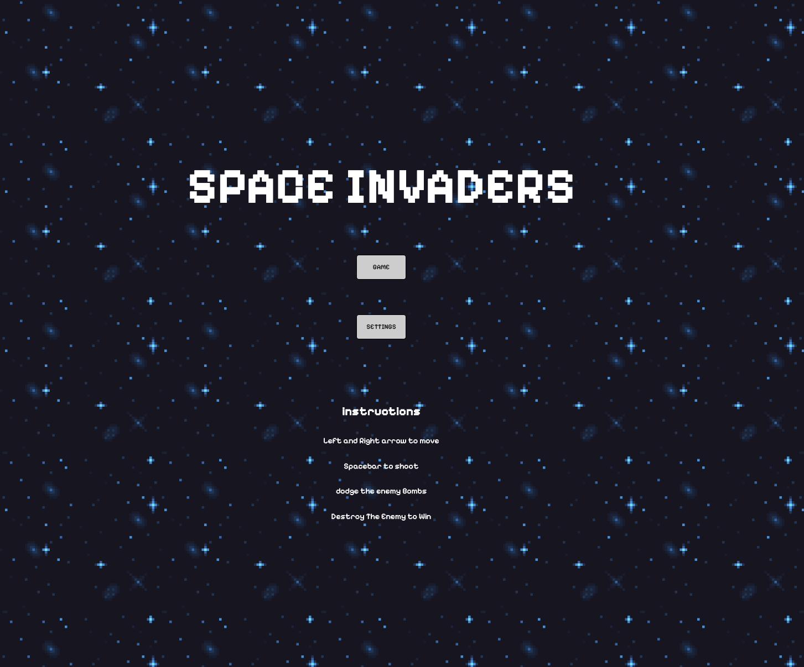
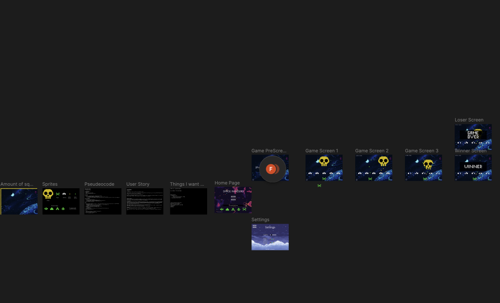
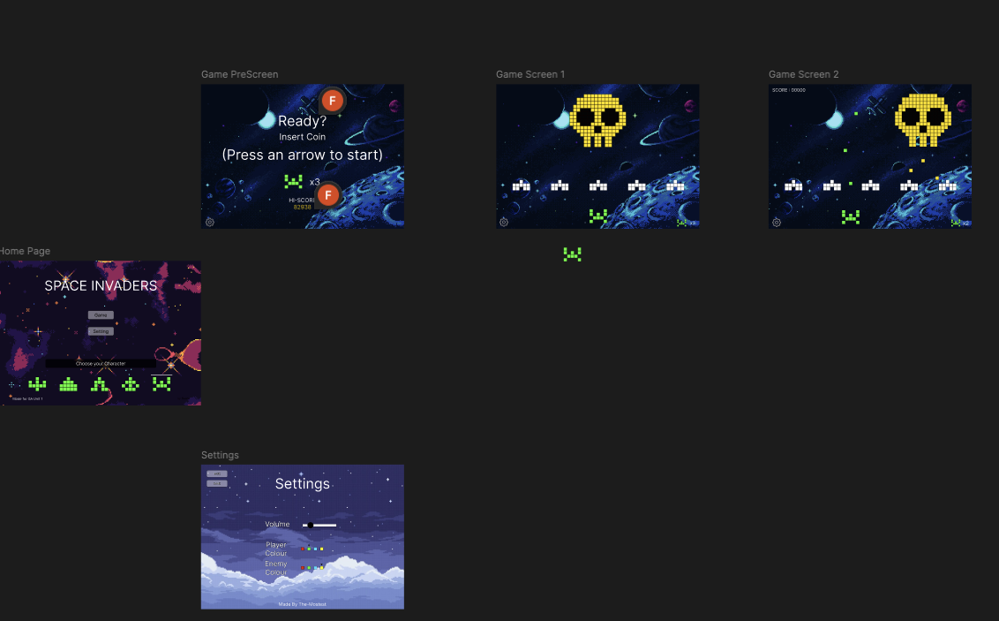

# SpaceInvaders

by Finn McDougall

## Contents
1. My Project
2. Plan
    - Setting up wire frame
    - Getting each page barebones
3. In depth:
4. Home Page
5. Settings
6. Game


### The Project - Space Invaders

Space Invaders - the technical phenomenon created in 1978 by Japanese Game Company TAITO CORP.
I decided to base this project on the original game as I love the aesthetic of pixelated art. Alongside the music and the *somewhat* simplicity of the game mechanics, I thought this would be a worthy challenge for my coding abilities (little did I know that I would find it rather difficult).
The project itself took me around 5 days to complete.


### Deployment Link
[SPACE INVADERS](https://the-mostest.github.io/space-invaders/) - click here

### Code Installation
To access the code. Please follow this link
<br>
[Link to Code](https://github.com/The-Mostest/space-invaders.git)
<br>

### Timeframe & Working Team (Solo/Pair/Group)
This project was a solo project, I however obviously at times needed assistance and spoke to my peers to understand some problems I may have been having but all in all this project was written entirely by me.

### Technologies Used
Technologies used include - VS CODE, Javascript, HTML, CSS, Google Chrome and various sites within chrome, such as StackOverflow

### Brief
Here is a link to the Brief: <br>
[Link to Brief](https://pages.git.generalassemb.ly/modular-curriculum-all-courses/browser-based-game-project/project-requirements/)


### Planning

When planning for this project I ended up using FIGMA.
Within this app, I managed to layout the wire frame, setup and plan a structure to the site and develop on the brief we were given.



As you can see, within the design itself I managed to plan out the theme of the game. I went with a retro feel with the 8-bit pixelated game. I did this to pay respects to the original game of space invaders.

I then wrote out a 'user story' to allow myself to visualize how I wanted the user to experience my game.


### Build Process

My approach to the code started as follows
1. Create a HTML, JavaScript & CSS file
2. Create a very basic homepage consisting of the buttons to take me to the other pages
3. Create a 'pop up' system to play the game and see the settings
    - This was done by toggling classes on button click 
 ```
    <div> id='settingsPage' class="popoff" </div>

    .popoff {
  visibility: hidden;
}

.popup {
  visibility: visible;
}
```
4. Create my grid and start to flesh out the player and enemy sprites
```

const width = 57;
const height = 41;
let totalCells = width * height;

for (i = 0; i < totalCells; i++) {
  const cellEl = document.createElement("div");
  cellEl.id = i;
  //   cellEl.innerText = i;
  cellEl.style.fontSize = "10px";
  cellEl.classList.add("cell");
  cellEl.style.height = `${100 / height}%`;
  cellEl.style.width = `${100 / width}%`;

  if (enemyPosition.indexOf(i) !== -1) {
    cellEl.classList.add("enemy");
  }
  if (playerPosition.indexOf(i) !== -1) {
    cellEl.classList.add("player");
  }

  cellStore.push(cellEl);
  grid.appendChild(cellEl);
}

```
5. I then looked at the mechanics of the  game. I knew this would take the longest so I left most of the CSS until the end
6. After completing the game mechanics I then looked at fleshing out my CSS. I managed to add gif backgrounds and colours to the game.
7. Lastly I looked at add a audio element to the game. On the enemy hit, player shooting and background music.
```
backgroundMusic.volume = 0.1;
explosionSound.volume = 0.01;
shootSound.volume = 0.01;
volumeSlider.addEventListener("click", () => {
  backgroundMusic.volume = volumeSlider.value;
  explosionSound.volume = volumeSlider.value;
  shootSound.volume = volumeSlider.value;
});
```
8. I realised I would have to create a button to play the background audio and swiftly did so.
```
musicButton.addEventListener('click', () => {
  backgroundMusic.play();
})
```

### Challenges
- Programming the grid itself
- Understanding how to create an enemy that moves automatically
- Creating the function that allows the player to shoot and the missiles to travel and 'explode' on contact with the enemy

These were the MAIN challenge I found which in total took me about 3 days to complete. I did so by asking for help from the instructors, using Youtube in my spare time and searching the web with websites like stack overflow and MD.

The hard part with all this is understanding what I need to search in the first place.
I learnt of a new technique with psedocode that I think will greatly benefit me in the future.

### Wins
My 2 proudest moments were. Creating the grid, placing audio on the character and completing the project.

I found this extremely stressful as far as project goes and spent quite a lot of time face down on the floor working out the code mentally, so the fact I completed it really does make me proud.

### Takeaways
The best thing I've learnt from this project is going to be how to use Psudeocode to help me to break down projects and answer the really tough questions. Here is an example of how in depth the psudocode could be.


```
// ? As a user I want to be able to fire a missile from the player and destroy an enemy
// * I want to press spacebar to initiate the missile launch
//   - Listen for a pressed spacebar
//     > On the document listen for a keydown event on addEventListener
//     > The evt.keyCode for spacebar = 'Space'
//   - when pressed execute a function called fireMissile
// * Once I have pressed the spacebar I should be able to see the missile on the screen
//   - Missile should appear directly above the player
//     > The player is an array of 5 positions. The central position is at index 1. This is the position to fire from.
//     > We need to take the position at index 1 and minus the width to get the index of the missile. Save this index to `missilePosition`
//   - To make the missile appear we should add the class of 'playerMissile' to the cell
//     > Once we have found the position of the missile we will target the cell stored in `missilePosition`
//       - cells are stored in an array called cellStore. We will use `missilePosition` to target the relevant cell
//     > We can then apply a class of 'missile' to that cell
//       - once cell is targeted, use classList.add() to add the 'missile' class
// * The missile should automatically go upwards towards the alien
//   - The position of the missile is stored in `missilePosition`. We want to move this to the cell above.
//     > remove the class of missile from the `missilePosition` cell
//     > add the class of missile to the cell above. To find the cell above, minus width from `missilePosition`
//   - Using an interval, we will repeat this process to keep the missile moving
//     > The interval will run on a 100ms loop, each time performing the above tasks
// * If the missile goes outside of the board, we should remove the missile
//   - As the missile rises, if the index becomes negative, it is out of bounds
//     > if the new position for the missile is less than 0, it has gone out of bounds
//     > Stop the missile interval with clearInterval
//     > Ensure the class has been removed from the previous missile position
// * If the missile hits the alien it should explode and destroy the alien and itself
//   - If the cell at `missilePosition` contains both the `missile` and `enemy` class then identify a collision
//     > to find the cell at `missilePosition` we will target it using cellStore[missilePosition]
//     > Then we will use classList.contains to identify whether the missile and enemy classes are present
//     > if they are we want to:
//       - remove both classes from the cell (enemy and missile)
//       - remove the `missilePosition` from the alien array
//       - add 100 to the `score` variable
```


### Bugs


### Future Improvements
In the future I would like to add:
- A mechanic that lets the enemy drop bombs to combat the player
- A system in which everytime the player shoots they lose 10 points. This would make the player aware of their shots
- Adding a 2 player mode to see how can score the most points
- Add an increase of speed of the enemy each time the enemy hits the wall and changes direction